# flutter_app

A new Flutter application.

## Getting Started

This project is a starting point for a Flutter application.

A few resources to get you started if this is your first Flutter project:

- [Lab: Write your first Flutter app](https://flutter.dev/docs/get-started/codelab)
- [Cookbook: Useful Flutter samples](https://flutter.dev/docs/cookbook)

For help getting started with Flutter, view our
[online documentation](https://flutter.dev/docs), which offers tutorials,
samples, guidance on mobile development, and a full API reference.

Flutter:
•	Good performance
•	Smooth Animation
•	Beautiful design
•	One code base compile to Android and iOS

Dart:
• Flutter is written in Dart
• Dart is a terse, strongly typed, object-oriented language
• C#, Javascript coding style
• It supports
o Just-In-Time compilation - Code is continuously recompiled directly on the device, allowing hot reload - Development
o Ahead-of-compilation – The code the app uses is compiled directly to native ARM code, leading to fast startup and predictable performance - Production

Set Up Your Environment
You can set up your development environment by following the instructions at https://flutter.io/setup for your operating system.

You can use many IDEs for developing Flutter apps, including Android Studio, IntelliJ, and VSCode. You can find instructions for these IDEs at https://flutter.io/using-ide.

If using Android Studio, please ensure your version is 3.1.x.
You can use a physical iOS/Android device or an emulator. If using an emulator, you can follow the instructions at https://developer.android.com/studio/run/managing-avds. You can select any device and any SDK. If unsure, choose the Pixel 2 and the most recent SDK. You can leave all settings as the default, and you can optionally enable hardware acceleration.
Note: We're using Android Studio 3 and the latest Android SDK at the time of recording.
If you come across any errors, you can try to debug these problems by looking in our Github issues, StackOverflow #flutter tag, and on Gitter. You can also file an issue or ask a question yourself.
Documentation: https://docs.flutter.io/
Github: https://github.com/flutter/flutter
StackOverflow: https://stackoverflow.com/questions/tagged/flutter
Gitter: https://gitter.im/flutter/flutter

To Install Flutter just goto flutter site and download Flutter zip and extract to a folder and then add Path variable in the environment variable. When we create a Flutter application Andriod studio ask us to select Flutter install location.
If you install Android Studio then need to install plugins for Dart (restart Android Studio) and Flutter (restart Android Studio). Also need to install Emulator.
Create a Flutter application.:
There two ways to create Flutter application

1. Using Adroid Studio -> New Flutter project -> Select Flutter Application
2. Command prompt type
   • Flutter create <Application Name>
   If you encounter any License error while running application, run
   flutter doctor --android-licenses
   • To run a flutter application from the application directory  --> <b>flutter run</b>
   * To hard reload prss <b>lower case r</b>
• The View of the Flutter application build as beautiful tree of widget

Ex.
<pre>
import 'package:flutter/material.dart';
void main() {
	runApp(
		MaterialApp(
			debugShowCheckedModeBanner: false,
			title: 'Hello Rectangle',
			home: Scaffold(
				appBar: AppBar(
				title: Text('Hello Rectangle'),
				),
				body: HelloRectangle(),
			),
		),
	);
}

class HelloRectangle extends StatelessWidget {
@override
Widget build(BuildContext context) {
return Center(
child: Container(
color: Colors.greenAccent,
height: 500.0,
width: 350.0,
child: Center(
child: Text(
'Hello!',
style: TextStyle(fontSize: 60.0),
textAlign: TextAlign.center,
),
),
),
);
}
}

</pre>
<ul>
	<li>
		When state changes by clicking a button Wedget automatically updates the UI
		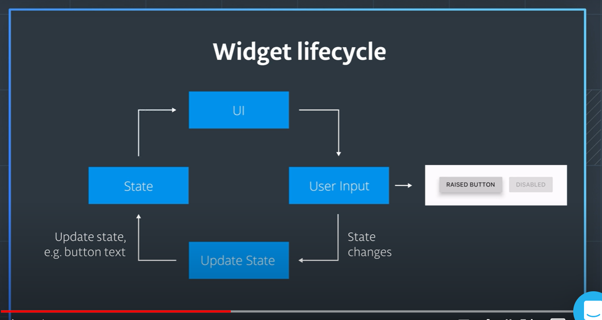
	</li>
	<li>
		Flutter’s rendering engine written in Skia.
		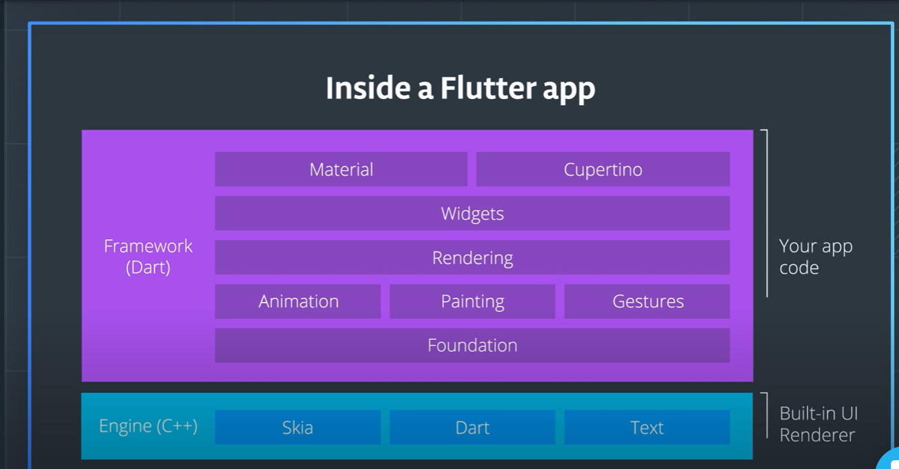
	</li>
	<li>
		Fundamental unit of Flutter is Widgets,
		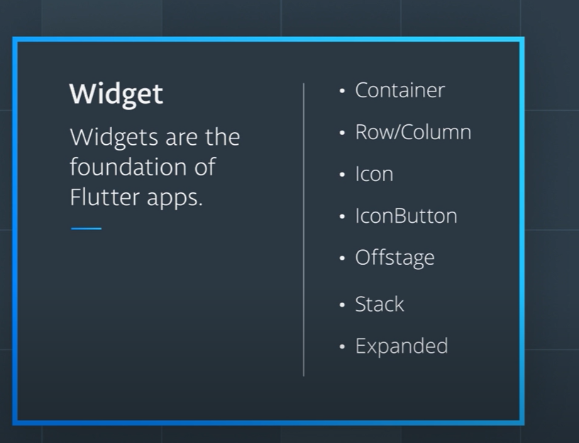
	</li>
	<li>
		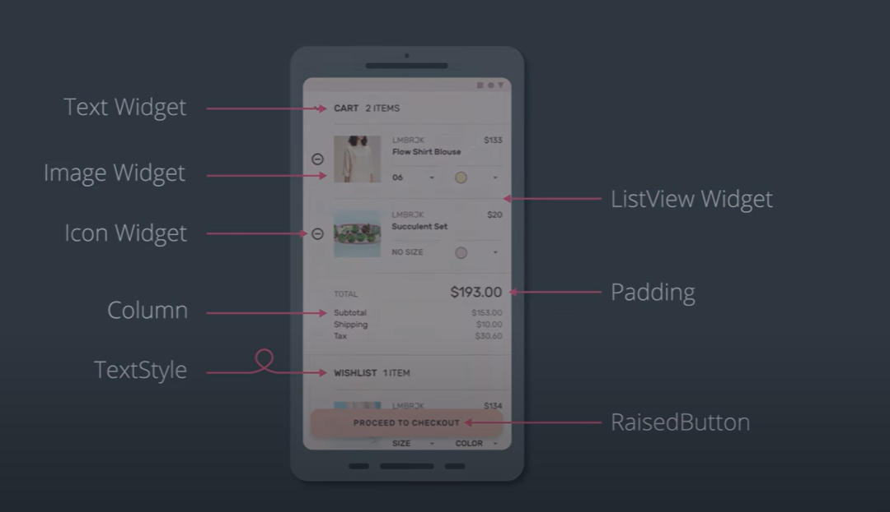
	</li>
	<li>
		There Two types of widgets
		<ol>
			<li>Stateful Widgets</li>
			<li>Stateless Widgets</li>
		</ol>
	</li>
	<li>
		Stateless widgets, we can change the values/properties of widgets
		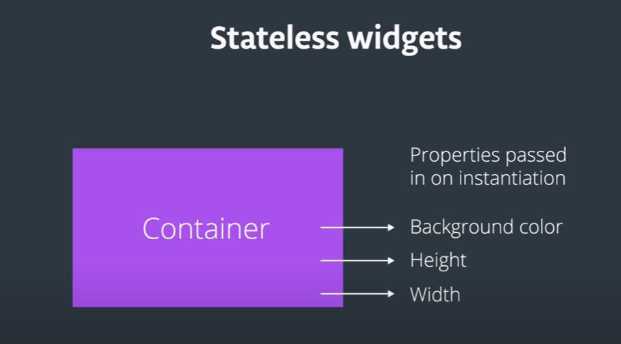
		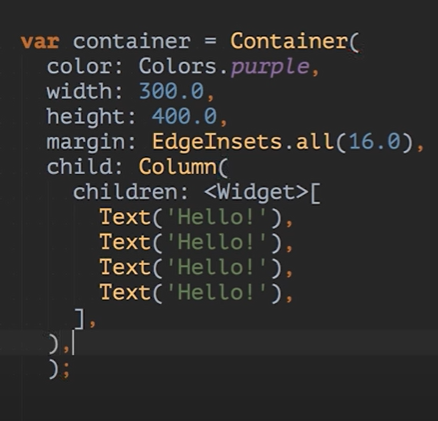
	</li>
</ul>
	Sample Flutter application
	<pre>
		import 'package:flutter/material.dart';
    	void main() {
    	  runApp(
    		MaterialApp(
    		  debugShowCheckedModeBanner: false,
    		  home: Scaffold(
    			appBar: AppBar(
    			  title: Text("Hello Rectangle"),
    			),
    			body: HelloRectangle(),
    		  ),
    		),
    	  );
    	}
    	class HelloRectangle extends StatelessWidget {
    	  @override
    	  Widget build(BuildContext context) {
    		return Center(
    		  child: Container(
    			color: Colors.green,
    			height: 400.0,
    			width: 300.0,
    			child: Center(
    			  child: Text(
    				'Hello World',
    				style: TextStyle(fontSize: 40.0, color: Colors.blue),
    			  ),
    			),
    		  ),
    		);
    	  }
    	}
    </pre>
    

    	Let say we want to arrage some item in rows, like below,
    	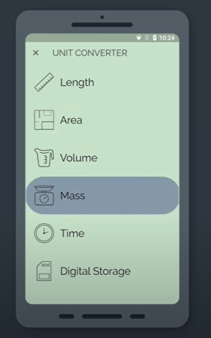
    	we need many element to construct the widget.
    	for example if take the first Item in the row, <b>Length</b>
    	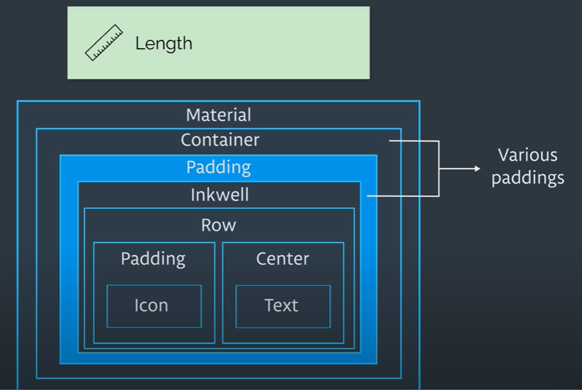
    

	If you set height and width of the containter or any other widget it will be ignore because the parent height and width passess to child object that means here MetirialApp which is full screen, passes to Containrer widget, so height and width will be ignore. Here we need to set wrap the containter into a Center widget wll works. Becase Center widget has relax from parent property inheritance.

	What is Padding and Margin?
	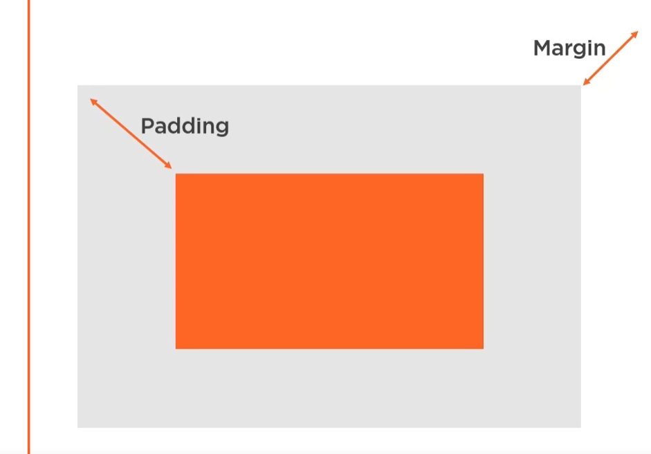
	in flutter if you want margin/padding for all sides
	<b>EdgeInserts.All(16.0)</b>.
	if you want only some sides
	<b>EdgeInserts.Only(left:16.0)</b>

	How to use custom font in widget?
	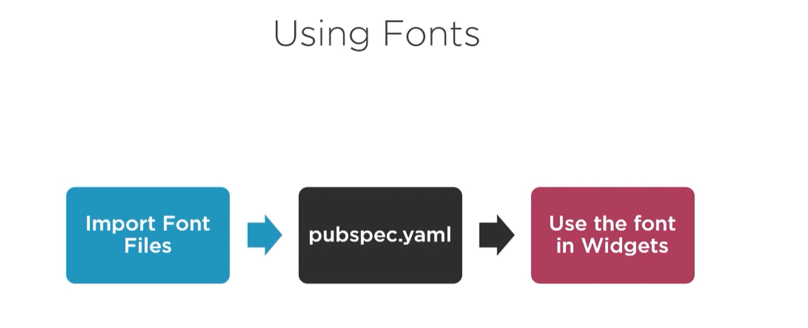
	<ol>
		<li>Create fonts folder in the project folder</li>
		<li>Goto fonts.google.com</li>
		<li>Search for font and select the font and download it</li>
		<li>open the zio file and cop only fonts files to the fonts folder of our project</li>
		<li><b>pubspect.yaml</b> is the file that contains our project meta data and dependencies.</li>
		<li>
			Update fonts section of the yaml file to the downloaded fonts
		</li>
	</ol>

	Flutter has <b>Row and Column</b> for arranging widget in Row column nature. 
	In the row if you want to fit all columns of the row within the mobile screen we can use <b>Expanded</b> widget.

	We can add images from multiple source and multiple format
	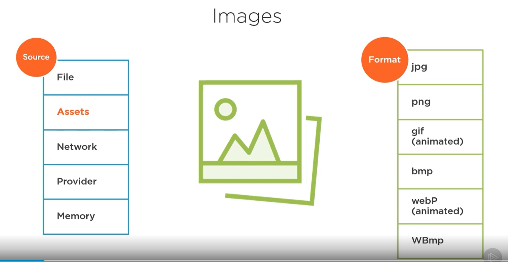 
	Greate source of simple images is <i>https://openclipart.org/</i>. It is free even for comercial use. 
	Once we download image, we need to update <b>pubspect.yaml</b> file for images.

	<h3>SqLite</h3> 
	SQLite is an in-process library that implements a self-contained, serverless, Zero-Configuration, Transactional SQL Database engin 
	<ul>
		<li>
			Self-Contained - It need minimal support from external libraries
		</li>
		<li>
			Serverless - It reads and wrties directly from/to database files on disk
		</li>
		<li>
			Zero-Configuration - No need of any installtion or setup
		</li>
		<li>
			Transactional - All changes in a transaction occure completely or not at all
		</li>
	</ul>
	

		How to use SQLite in Flutter? Using SQLite plgin for flutter - SQFLite 
		Include in pubspec.yaml
	

	

		<h4>Dependencies used</h4>
		<ul>
			<li>sqllite : any   - > The db plugin</li>
			<li>path_provider : any  - > Find commonly used location on the filesystem (physical path for saving db is different in Antriod and Ios</li>
			<li>intel: ^0.15.7 - > Internationalization package. includes date/number formating and parsing</li>
		</ul>
	

	

		We can use two types sql query in SQLite
		<h3>1.Using Raw SQl</h3> 
		It is normal sql Insert, Update and Delete queries 
		<ul>
			<li>
				db.rawQuery('SELECT * FROM yourTable');
			</li>
			<li>db.rawUpdate('UPDATE yourTable SET name=? where id=?',["newName","id"]);</li>
			<li>db.rawDelete('DELETE FROM youTable WHERE id=1');</li>
		</ul>
		<h3>2.Using SqLite Helpers</h3>
		<ul>
			<li>
				db.update('youTable', yourObject.toMap(), where : "$colId=?", whereArgs:[yourObject.id]);
			</li>
		</ul>
	

	

		in flutter Async function are avaiable using <b>Future, Async and Await</b>.
		

			<h3>Future</h3>
			<pre>
				Future<List> getTodos(){
					//Secondary thread
				}
				todosFuture = getodos().then((result){
						//Main thread
					});
			</pre>
			A Future represents a means for getting a value sometime in the future.
			 
			<h3>Async - Await</h3>
			<pre>
				void doSomething() async{
					result = await getTodos();
				}
			</pre>
			The async and await keywords allow you to write asynchrinous code that looks like synchronous code
		

		

			<h3>Navigation in Flutter</h3> 
			Navigation is showing pages in the screen, Navigation has a <b>Stack</b> that hold all the pages. it has two method
			<ul>
				<li>push()</li>
				<li>pop()</li>
			</ul>
			- push() put a new page on top of the stack
			- pop() removes the page from the screen so the previous page will be visible on the screen.
		

	

	

		<h3>Gusture and Animations</h3>  
			<h4>Flutter layouts</h4> 
			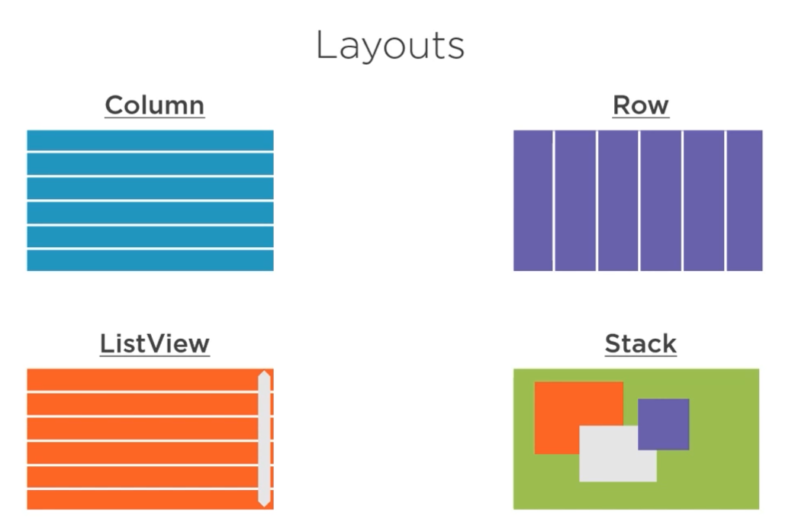
			<ul>
				<li><b>Stack: A widget that positions its children relative to the edge of its box</b></li>
				<li><b>Stack: A widget that positions its children relative to the edge of its box</b></li>
			</ul>
	

